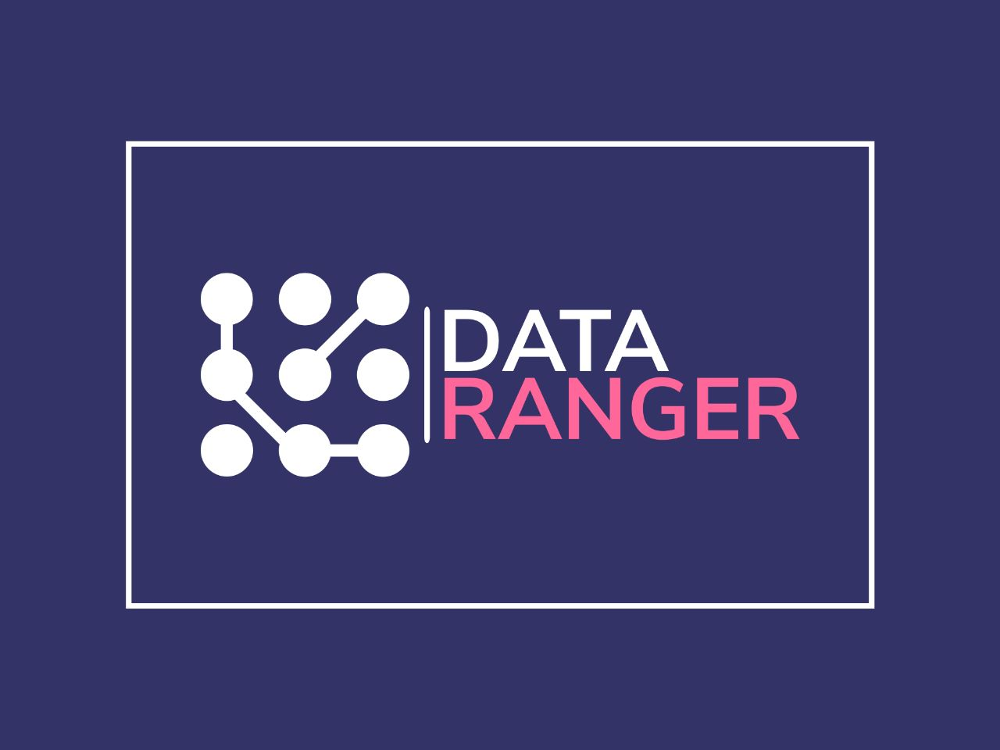
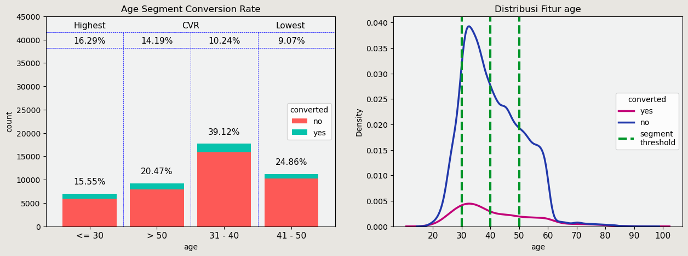
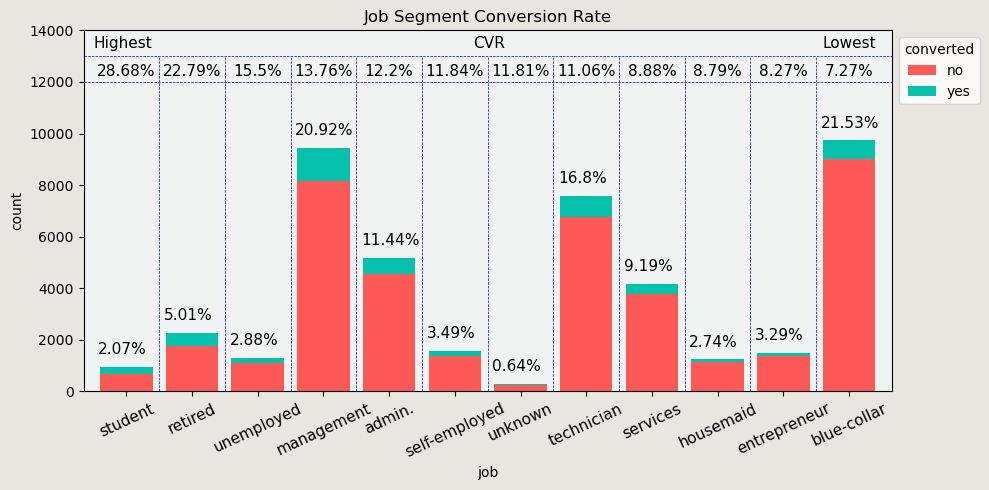
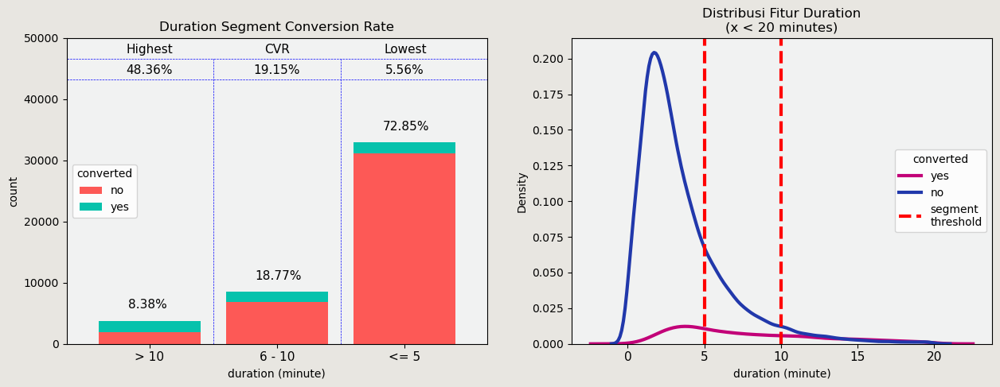
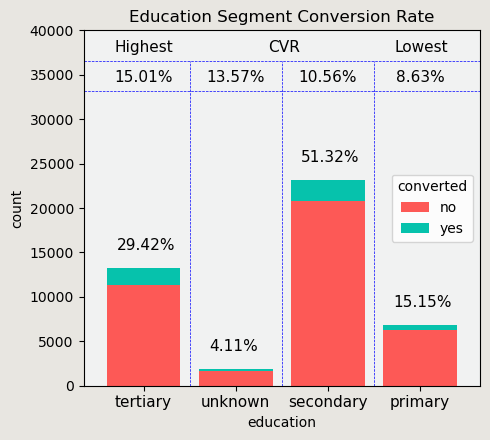
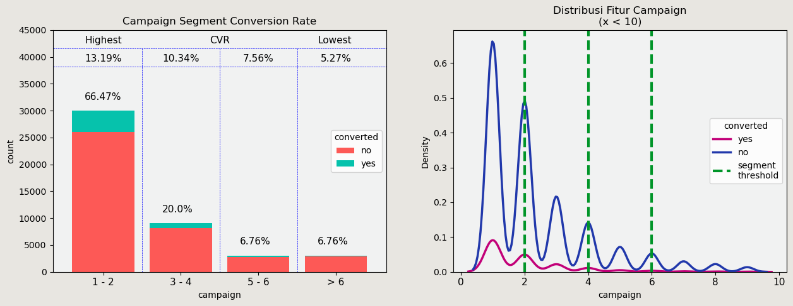

 
  

<h1 align="center"> Data Ranger </h1>

<h4 align="center">A data scientist team constitutes of 8 hailed accross various expertises</h4>

## ⚡ Overview

 
  To summarize this world of project, a financial industry wishes to lift their sales of deposit by increasing the conversion rate that was about only 11% into 15%, the number of new customers captured divided by the size of population exposed, by running a campaign of business team. We are as a data scientist team assigned to figure out this case and offering several business recommendation

## 💡 Insights and Business Recommendations

 
  

<h3>⭐️ Insight</h3>

  Nasabah dewasa awal dengan umur dibawah 30 tahun memiliki nilai conversion rate yang tertinggi disusul dengan nasabah era silver age dengan umur diatas 50 tahun. Nasabah silver segment ini cenderung untuk memilih deposito dengan fixed rate sebagai low risk investment mereka sekaligus menjadi passive income pada usia menjelang masa retirement/pensiun.

<h3>📝 Business Strategy</h3>

 
  Mengerucutkan target marketing pada nasabah dewasa awal yang telah memiliki wawasan akan pentingnya investasi deposito dan nasabah diatas 50 tahun yang membutuhkan produk deposito dimana sesuai dengan produk yang sedang dilakukan campaign oleh tim marketing

 
  

<h3>⭐️ Insight</h3>

  Nasabah dengan occupation student dan retired menunjukkan nilai conversion rate tertinggi, hal ini sejalan dengan insight yang telah diidentifikasi berdasarkan fitur age

<h3>📝 Business Strategy</h3>

 
  Selain menargetkan kedua segment tersebut, dirasa perlu untuk memberikan perhatian pada occupation management dan blue-collar dimana kelompok tersebut memiliki karir dan golongan terpelajar sehingga perlu diberikan pengarahan akan esensi dari produk deposito

 
  

<h3>⭐️ Insight</h3>

  Durasi telephone diatas 10 menit menyumbang nilai conversion rate yang paling tinggi, namun hal tersebut akan membuat pengeluaran program campaign semakin melambung seiring dengan meningkatnya durasi penawaran melalui telephone

<h3>📝 Business Strategy</h3>

 
  Untuk mengoptimalkan campaign dari berbagai dimensi, pertimbangan yang kami berikan adalah memaksimalkan waktu 5 menit untuk memberikan penawaran pada nasabah yang memiliki kapasitas untuk meningkatkan potensi konversi

 
  

<h3>⭐️ Insight</h3>

  Nasabah dengan tingkat education tertiary memiliki nilai conversion rate paling tinggi, sedangkan pendidikan primary dan secondary membentuk lebih dari 65% nasabah

<h3>📝 Business Strategy</h3>

 
  Memberikan persepsi kepada nasabah dengan tingkat pendidikan dan pengetahuan finansial lebih rendah akan substansi dan benefit dari produk investasi deposito untuk hari tua nantinya

 
  

<h3>⭐️ Insight</h3>

  Hubungan antar tiap segment fitur campaign dan kelas/target menunjukkan bahwa nasabah yang menerima contact dalam campaign sebanyak 1 - 2 kali memiliki nilai conversion rate yang paling tinggi. Semakin banyak penawaran yang diterima nasabah kecenderungan konversi semakin rendah.

<h3>📝 Business Strategy</h3>

 
  Identifikasi nasabah dari sekitar 66% target menjadi lebih spesifik karena hanya sekitar 13% yang memutuskan untuk konversi

### 💙 Our Contributor

<h4 align="left"> 
  🐼 Hunayn Risatayn 
  🐼 Indah Kusuma Wardani 
  🐼 Nindy Salsabila Hanin Zahra 
  🐼 Athira Syifa Puti Salim 
  🐼 Zery Triputra 
  🐼 M. Khairul Ardi 
  🐼 Muhamad Amar Nadhif 
  🐼 Andriansyah Firdimas 
</h4>
